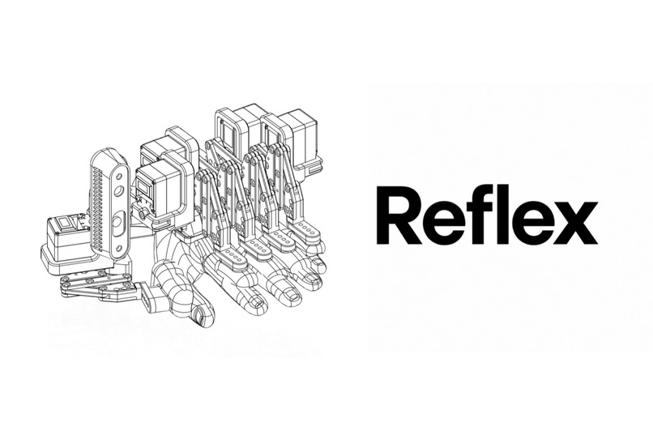

# Reflex

**Usually, humans write skills for Claude. We wanted a hand where Claude could write skills for humans.**

Reflex is a five-finger robotic exoskeleton hand built at Hack the North 2026.
It combines programmable finger movements, hand-tracking teleoperation, and an
imitation-learning pipeline with a live digital twin. The same control interface
drives the simulated hand and the real servos.

The inspiration is hand-over-hand teaching: capture a physical motion, repeat it,
and explore how an AI can help guide it. Reflex is a hackathon prototype, not a
validated rehabilitation device.

## What It Does

- **Agent-controlled movement:** an MCP server lets Claude inspect finger positions,
  command poses, and write or run named movement sequences.
- **Hand mirroring:** MediaPipe tracks a controller's hand through a webcam and
  translates its motion into finger commands after calibration.
- **Demonstration recording:** record and replay episodes from the console. The
  LeRobot integration connects demonstrations to SmolVLA training and inference.
- **Live digital twin:** a Three.js URDF view shows measured and commanded motion,
  IMU orientation, and tracked objects alongside RGB/depth feeds and motor telemetry.
- **Reusable skills:** rehearsed piano routines and taught movements live as
  readable Python files in [`movements/`](movements/README.md).

## Architecture

```text
Web console / Claude MCP
           |
     FastAPI backend
           |
        rosbridge <--- LeRobot / learned policy
           |
     ROS 2 hand HAL
       /         \
ros2_control   USB bus adapter
     |               |
   Gazebo       Feetech servos

Camera frames, IMU, and measured state flow back to the console.
```

Commands use five normalized finger positions in **thumb, index, middle, ring,
pinky** order: `0` is open and `1` is closed. Each finger has one controlled degree
of freedom. The HAL applies motion limits and hardware-specific control; agents
and learned policies use that same low-level interface.

## Tech Stack

| Area | Technology |
| --- | --- |
| Hardware | Feetech ST3215 bus servos, 3D-printed linkages, USB servo adapter |
| Sensing | Intel RealSense D435i RGB/depth/IMU; iPhone + Record3D head camera |
| Robot control | ROS 2 Humble, `ros2_control`, Gazebo Fortress, rosbridge |
| Backend | Python, FastAPI, `roslibpy`, OpenCV, MediaPipe |
| Console | Next.js, React, TypeScript, Three.js, React Three Fiber, `urdf-loader`, Zustand, Tailwind, shadcn |
| Agent interface | MCP tools for inspection, movement, and skill creation |
| Learning | LeRobot, SmolVLA, PyTorch |

## Quick Start

### Console Without Hardware

On Linux or WSL, install Python with `venv`, Node.js/npm, and the standard shell
utilities used by the launcher. From the repository root:

```bash
MOCK=1 ./application/dev.sh
```

Open **http://localhost:3000**. The launcher installs backend/frontend dependencies
on first run and starts FastAPI on port `8000` and Next.js on port `3000`.
Mock mode supplies synthetic hand state and camera feeds without ROS or hardware.

See the [console guide](application/README.md) for configuration and the
[API contract](application/CONTRACT.md) for topics and message formats.

### ROS Simulation

With ROS 2 Humble and Gazebo Fortress installed:

```bash
./physical_layer/build.sh
source physical_layer/ros2_ws/install/setup.bash
ros2 launch htn_launch sim.launch.py camera:=none
```

In a second terminal:

```bash
./application/dev.sh
```

Use `gui:=true` for the Gazebo window or `teleop:=false` to skip the finger-control
window. The simulator does not supply synthetic camera images: connect a real
camera for vision workflows, or use console mock mode.

Without a native Humble environment,
[`physical_layer/docker/run.sh`](physical_layer/docker/run.sh) provides a container
with the repository mounted. The host-side
[RealSense bridge](physical_layer/camera_bridge/realsense_bridge.py) can publish
camera data over rosbridge without a local ROS installation.

### Real Hand

After configuring servo IDs, calibration, and the serial device:

```bash
ros2 launch htn_launch hardware.launch.py serial_port:=/dev/ttyACM0
```

Physical dimensions, joint limits, and servo calibration live in
[`hand_params.yaml`](physical_layer/ros2_ws/src/htn_description/config/hand_params.yaml).
Read the [physical-layer notes](physical_layer/CLAUDE.md) before changing hardware settings.

The finger-control window uses `Q W E R T` to open the thumb through pinky and
`A S D F G` to close them. Release a key to hold position. Sliders and preset
gestures are available too. Foxglove can connect at `ws://localhost:8765`; import
the [hand layout](physical_layer/foxglove/htn_hand.json) for robot and camera views.

## Connect Claude

The MCP server is a separate client of the backend. Starting the console does
not automatically register it. On Linux/WSL, from the repository root:

```bash
python3 -m venv mcp_server/.venv
mcp_server/.venv/bin/pip install -r mcp_server/requirements.txt
claude mcp add htn-hand -- "$PWD/mcp_server/.venv/bin/python" "$PWD/mcp_server/server.py"
```

With the backend running, Claude can use `get_hand_state`, `move_hand`,
`list_skills`, `teach_skill`, `run_skill`, and `stop_skill`. For example:
"Read the hand state, then make a peace sign."

See the [MCP guide](mcp_server/README.md) for Claude Desktop, HTTP transport, and
remote backend configuration. MCP commands use the backend directly, so the
console's ARM switch does not gate them. HAL limits still apply; passive mode
disables motor torque and ignores motion commands.

## Learning From Demonstrations

The hand is packaged as a LeRobot robot. Record demonstrations using the console
or LeRobot tooling, then use the policy pipeline for SmolVLA training and inference.
The policy runs separately from ROS and communicates through rosbridge.

See the [policy guide](policy/README.md) for Python requirements, dataset collection,
training, and inference commands. Policy performance depends on the demonstrations
and checkpoint; the presence of training tooling is not a guarantee of general skill transfer.

## Repository Map

| Directory | Purpose |
| --- | --- |
| [`physical_layer/`](physical_layer/CLAUDE.md) | Robot description, ROS launch files, HAL, servo backends, teleop, camera bridges, and Docker setup |
| [`application/`](application/README.md) | FastAPI backend and live web console |
| [`mcp_server/`](mcp_server/README.md) | Claude-compatible hand-control and skill-management tools |
| [`movements/`](movements/README.md) | Rehearsed and agent-taught finger routines |
| [`policy/`](policy/README.md) | LeRobot integration, recording, training, and inference tooling |
| [`docs/`](docs/) | Designs, development notes, and demo instructions |

## What's Next

- Finish compliant, torque-on hand-guiding control. Existing torque-off backdrive
  mode is distinct from a tuned, soft hand-guiding controller.
- Expand the demonstration dataset and evaluate learned skills beyond their
  training examples.
- Explore how recorded motions and agent-authored skills can support physical
  skill practice and assistive tasks.
