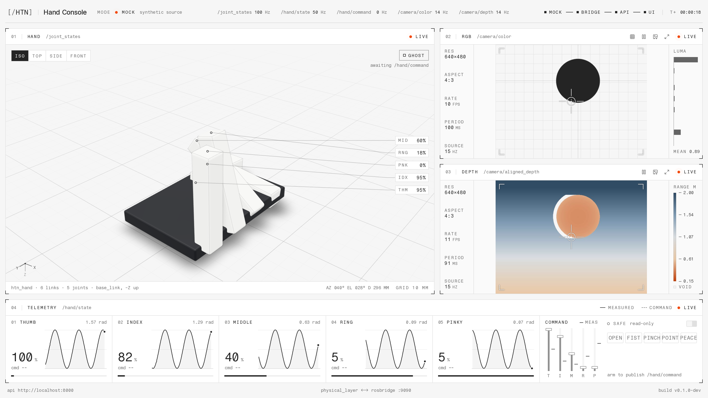

# application/ - hand simulator console



A one-screen web console for the exoskeleton hand: a three.js viewport of the hand
moving live with a map of the objects around it (detected in the wrist camera, placed with its
depth, remembered when they leave the view), a RealSense panel and an iPhone (Record3D) panel that each switch between
RGB and colorized depth, per-finger telemetry,
and an ARM-gated command block. It only consumes ROS topics from `physical_layer/`,
so it looks the same for the Gazebo sim and the real hardware.
```
physical_layer (ROS 2) --rosbridge ws :9090--> backend (FastAPI :8000) --ws/http--> frontend (Next.js :3000)
```

- `backend/`  - FastAPI + roslibpy. The only thing that talks to ROS. Caches the latest
  value of every topic, colorizes depth, serves `/api/health`, `/api/urdf`, `/ws/state`,
  `/ws/camera/{realsense,iphone}/{color,depth}`. Reconnects to rosbridge forever. It is also
  the WebRTC peer of the iPhone (Record3D Wi-Fi streaming), since the phone allows one viewer.
- `frontend/` - Next.js, Tailwind, shadcn/ui, motion, three.js (@react-three/fiber, urdf-loader).
- `CONTRACT.md` - every API shape, topic and design rule. Read it before changing either side.

## Run

```bash
# terminal 1 - the ROS side (starts rosbridge on :9090; hardware.launch.py works the same)
ros2 launch htn_launch sim.launch.py

# terminal 2 - backend + frontend, Ctrl-C stops both
./dev.sh                # then open http://localhost:3000
MOCK=1 ./dev.sh         # no ROS at all: synthetic hand, color and depth
```

`dev.sh` creates `backend/.venv` and `frontend/node_modules` on first run. The object
detector is optional: `backend/.venv/bin/pip install -r backend/requirements-detect.txt
--extra-index-url https://download.pytorch.org/whl/cpu` (CPU torch, ~300 MB); without it the
map stays empty in live mode and the backend says so once. Start order does
not matter: with ROS down the console shows OFFLINE / NO SIGNAL and recovers on its own.

| env | default | |
|---|---|---|
| `MOCK` | `0` | `1` = synthesize everything |
| `MOCK_OBJECTS` | `0` | `1` = live ROS, synthetic objects around the hand (a sim has no camera) |
| `DETECT_MODEL` | `yolov8n.pt` | Ultralytics model that finds the objects around the hand in the RealSense image; needs `backend/requirements-detect.txt`, `""` turns it off |
| `DETECT_HZ` / `DETECT_THREADS` | `4` / `2` | detector passes per second at most, and its torch threads (it shares the CPU with the sim and the browser) |
| `RECORD3D_ROTATION` | `90` | iPhone image rotation, clockwise; the panel's rotate button changes it live |
| `RECORD3D_HOST` | empty | iPhone address, or `usb` for the cable; normally set from the iPhone panel instead |
| `ROSBRIDGE_HOST` / `ROSBRIDGE_PORT` | `localhost` / `9090` | where rosbridge listens |
| `BACKEND_PORT` / `FRONTEND_PORT` | `8000` / `3000` | dev.sh ports |
| `BACKEND_HOST` | `127.0.0.1` | dev.sh bind address of the API; `0.0.0.0` from a container or for another machine |
| `DEPTH_MIN_MM` / `DEPTH_MAX_MM` | `150` / `2000` | depth colormap range |
| `CORS_ORIGINS` | `http://localhost:3000,http://127.0.0.1:3000` | pages allowed to call the API and open its websockets |

Viewing from another machine needs `CORS_ORIGINS=http://<host>:3000`, `NEXT_PUBLIC_BACKEND_URL=http://<host>:8000`
and `BACKEND_HOST=0.0.0.0`.

Commands only leave the page while the ARM switch is on; it disarms itself when ROS drops.

Checks: `backend/.venv/bin/pytest` (needs `requirements-dev.txt`); in `frontend/`: `npx tsc --noEmit && npx eslint . && npm run build`.
